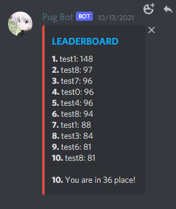

# `Discord-Pug-Bot`
Discord bot to create scrims/pugs

The bot is programmed entirely in Python 3, and it makes use of the [discord.py](https://github.com/Rapptz/discord.py) package.

## Introduction

The bot will keep tracker of players elo, wins, and loses. It will also decide the map, teams, and who defends first. Temp roles and voice channels are also created. The bot will move players who are in voice chats to their teams voice chat automatically. After a game is played users will do a command to call the result of the match in which the bot will update all the players information automatically.

## Requirements

The bot requires at least Python 3.9. 
pip install discord.py

## Usage

Create a discord bot and put the token in config.

######### UPDATE CHANNEL IDS ###########

The main flow for this bot is as follows:

1. Players register (Only Once)
2. 10 Players join the queue
3. Bot decideds teams and makes temp roles / voice channels
4. Play the game
5. Do results command to call results of the game.
6. Repeat
(Multiple games can run at the same time)

Here's the list of commands:

| Command                       | Action                                                                                                     |
| :---------------------------- | :--------------------------------------------------------------------------------------------------------- |
| `..register [name]`           | Register to the bot with default stats                                                                     |
| `..stats [name]`              | Check a registered players Stats                                                                           |
| `..leaderboard   `            | Check the top players                                                                                      |
| `..join`                      | Join the queue                                                                                             |
| `..leave`                     | Leave the queue                                                                                            |
| `..queue `                    | Check how many people are in queue                                                                         |
| `..help`                      | Will show a list of commands                                                                               |
| `..changename [name]`         | Change a players name to something different                                                               |
| `..players`                   | Shows how many people are registered to the bot                                                            |
| `..matchresult [game#] [team]`| Calls the result of that match to give players the updated stats                                           |
| `..matchend [game#]`          | End the pug to release players from a game that did not play out                                           |
| `..win [name]`                | Give a player 1 win plus 5 elo                                                                             |
| `..lose [name]`               | Give a player 1 loss and minus 3 elo                                                                       |
| `..elo [name] [#]`            | Randomly assign captains in your PUG, if there're enough people                                            |
| `..clearqueue`                | Clear the player queue                                                                                     |
| `..unregister [name]`         | Unregister a person from the bot                                                                           |
| `..testp`                     | Adds 9 bots to the queue for testing purposes                                                              |
| `..testm`                     | Creates a test match for testing purposes                                                                  |
